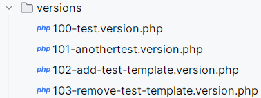
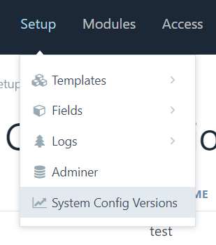
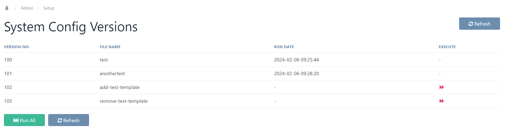

# System Config Versions

This [ProcessWire](https://processwire.com) module adds an admin interface for developers to manage configuration revisions. Think of it as git for PW configurations 😊.

It ensures that revisions only get run once. It is possible to run multiple revisions up to a certain point or even all available ones.

### Disclaimer
Currently, this plugin is in beta, do not use on production systems!

### ToDo
* __URGENT: Greatly improve error handling__
* Add GitHub Actions support to automatically apply all new versions
* Add ability to reset run status down to a certain point
* Revise documentation below
* Add configurability for versions folder location and file naming scheme
* Add folder as version support (e.g. all files inside a version folder are executed and treated as one revision).

## Aren't you just copying [RockMigrations](https://processwire.com/modules/rock-migrations/)?
No. I made this plugin because at work, we needed more precise control over migrations and also do a lot more in migrations than adding&removing structural configurations. Often times, we use small snippets to change field data throughout the process of creating websites. And these may only be run _exactly once_.

__Actually, we are usually using RockMigrations alongside this plugin to use it's very impressive function set!__ Think of this plugin as a way to persist run status for any migrations and ensure any migration only ever gets run once.

## Usage
In your site's `templates` folder, add a new folder called `versions`. This is where your revisions live:

The naming scheme for the revision files is `{version_no}-{file name}.version.php`. Currently, `version_no` must be `100` - `99999`. Currently `file name` can be anything.

### Revision file contents

These files simply get run with the full PW API context. The beautiful thing is, you can do whatever you want in these - **you can even use RockMigrations**!

### Backend GUI

After installation, you can find the Admin GUI in the _Setup_ menu:

The Admin GUI is a simple list of all revisions available and some controls to run them:

The run button inside the table will run all revisions up to and including the current one.

The "Run All" button will run all revisions which haven't been run yet.
